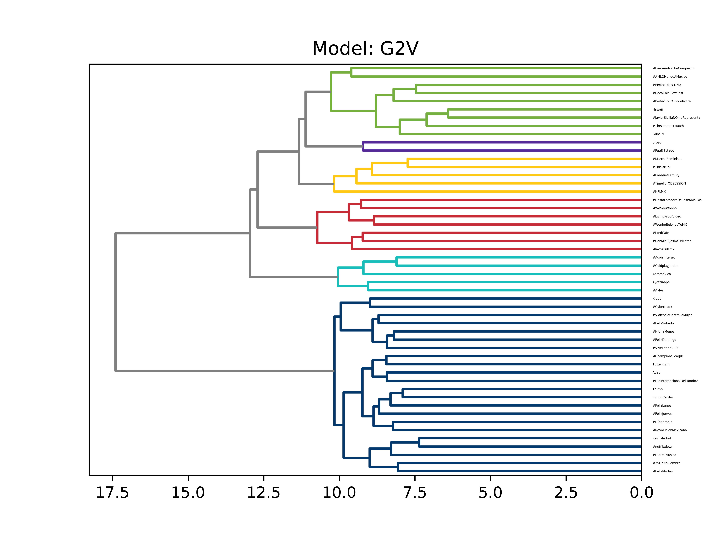

# graph2vec 

* graph2vec.py - Convierte del archivo original a lista de aristas.
* g2vec_output_dictionary.pickle - Embeddings con dimensión 128
* g2vec_output_dictionary256.pickle - Embeddings con dimensión 256
* cluster.py - Lee los embeddings en formato .pickle y realiza un clustering jerárquico.

